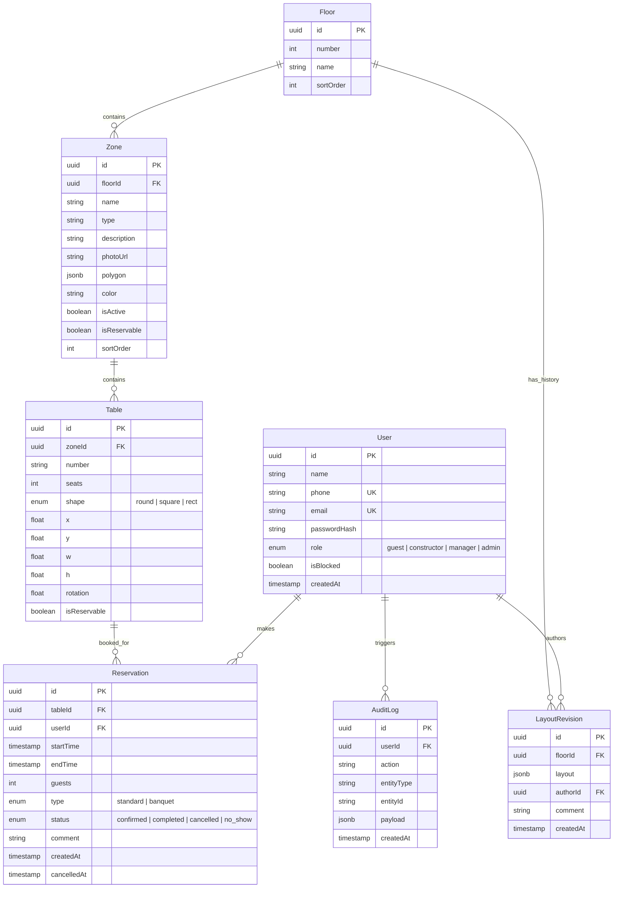

# Конструктор схем и бронирование столов ресторана — дизайн-документ (ТЗ)

Дата: 2026-10-04  
Статус: скорректировано (скоуп: Конструктор 2D-схем ресторана и Бронирование столов)

---

## 1. Обзор

Система состоит из двух ключевых взаимосвязанных подсистем:
1. **Интерактивный 2D-конструктор схем залов**: визуальный редактор для проектирования этажей, функциональных зон и расстановки столов с сохранением геометрии и публикацией ревизий.
2. **Сервис бронирования столов**:
   - **Гостевой интерфейс**: просмотр интерактивной схемы зала ресторана, фильтрация по дате, времени и числу гостей, проверка доступности столов на выбранный слот, бронирование стола и управление своими бронями.
   - **Панель менеджера / администратора**: управление бронированиями (шахматка/список/схема), фиксация no-show, отмена/перенос броней, управление правами доступа.

> **Примечание по скоупу**: функционал обслуживания в зале (заказ блюд по QR, электронное меню, экран кухни KDS, вызовы официантов, прием платежей и чеки) исключен из текущей версии проекта.

---

## 2. Решения по ключевым развилкам (зафиксированы)

| Вопрос | Решение |
|---|---|
| Главный сценарий | Конструирование схемы зала ресторана + бронирование столов ДО визита гостем и управление бронями персоналом |
| 3D | Только 2D в первой версии; координаты и геометрия (x, y, w, h, rotation) совместимы с добавлением 3D-экструзии в будущем |
| Идентификация гостя | Аккаунты у всех пользователей; гость бронирует стол из авторизованного профиля (с подтверждением контактов) |
| Масштаб | Один ресторан, сущность «Сеть ресторанов» не вводится |
| Роли системы | Гость (`guest`), Конструктор (`constructor`), Менеджер бронирования (`manager`), Администратор (`admin`) |
| Стек технологий | React + TypeScript (Vite), Node.js (Express / NestJS) + TypeScript, PostgreSQL, Prisma ORM, Socket.IO |
| Архитектура | Модульный монолит |
| Рендеринг схемы | Единый компонент `<FloorPlanSVG>`: гостю — просмотр и выбор стола; конструктору — интерактивное редактирование |

---

## 3. Архитектура

```
┌─────────────────────────────────────────────────────────────┐
│ React SPA (Vite + TypeScript)                               │
│  ├─ Гостевая часть: выбор даты/времени, схема, бронь, ЛК    │
│  ├─ Конструктор 2D-схем: этажи, полигоны зон, столы, релизы │
│  ├─ Панель менеджера: журнал броней, шахматка, статусы     │
│  └─ Панель админа: управление пользователями, аудит-лог     │
└────────────┬────────────────────────────────────────────────┘
             │ REST API + WebSocket (Socket.IO)
┌────────────┴────────────────────────────────────────────────┐
│ Node.js + TypeScript, модули:                               │
│  auth · layout (схемы/ревизии) · booking (бронирование)     │
│  users · audit                                              │
└────────────┬────────────────────────────────────────────────┬─┘
             │ Prisma (ORM)                                   │
┌────────────┴──────────────────────┐           ┌─────────────┴─────────────┐
│ PostgreSQL                        │           │ Socket.IO-комнаты:        │
│ JSONB — снимки схем (ревизии)     │           │ layout:edit (блокировки)  │
└───────────────────────────────────┘           │ booking:updates (live)    │
                                                └───────────────────────────┘
```

### Общий SVG-рендерер схемы (`<FloorPlanSVG>`)
Один базовый SVG-компонент используется во всех интерфейсах:
- **В конструкторе**: обеспечивает drag-and-drop, вращение, ресайз столов, редактирование вершин полигонов зон, привязку к сетке (grid snapping).
- **В гостевом интерфейсе**: масштабирование/панорамирование (pan & zoom), подсветка зон и столов с учетом их доступности на выбранный временной слот, выбор стола кликом.
- **В панели менеджера**: отображение текущей занятости столов по временным срезам.

---

## 4. Роли пользователей

| Роль | Суть и зона ответственности |
|---|---|
| `guest` | Гость ресторана. Просмотр схемы, поиск доступных столов по параметрам, создание и отмена своих бронирований |
| `constructor` | Конструктор/дизайнер схем. Создание и изменение этажей, зон, столов; публикация и откат ревизий планировки |
| `manager` | Менеджер зала / хостес. Просмотр всех броней на календарной сетке/схеме, создание броней по телефону, отмена, отметка no-show |
| `admin` | Администратор системы. Управление учетными записями персонала, назначение ролей, просмотр аудит-лога, системные настройки |

---

## 5. Типы зон ресторана

Зоны определяются в конструкторе с помощью произвольных замкнутых полигонов, заливки и метаданных.

| Тип зоны | Видна гостю | Доступна для брони | Описание |
|---|---|---|---|
| Основной зал | ✅ | ✅ | Главная посадочная зона ресторана |
| Барная зона | ✅ | ✅ (опционально) | Барная стойка и столы (отдельные столы могут быть `isReservable = false`) |
| Веранда / терраса | ✅ | ✅ | Сезонная зона; может отключаться флагом `isActive` |
| VIP-комнаты | ✅ | ✅ | Изолированные кабинеты повышенной комфортности |
| Банкетный зал | ✅ | через менеджера | Зал для крупных мероприятий с ручным подтверждением менеджером |
| Вход / гардероб / ресепшн | ✅ | ❌ | Навигационные ориентиры для удобства ориентирования гостя |
| Технические / кухня / склад | ❌ (или контур) | ❌ | Служебные помещения (гость видит нейтральный контур или не видит вовсе) |

**Атрибуты зоны**: `floorId`, `name`, `type`, `description`, `photoUrl`, `polygon` (координаты вершин), `color`, `isActive` (активность/сезонность), `isReservable` (доступность для онлайн-брони), `sortOrder`.

---

## 6. Модель данных

Ключевой принцип: **статус стола не хранится статически**, а рассчитывается динамически для запрашиваемого интервала времени на основе подтвержденных бронирований и настроек доступности стола/зоны.

### 6.1 Сущности



#### Описание сущностей:

- **User**: пользователи системы (гости и сотрудники). Уникальность по телефону и email.
- **Floor**: этаж здания (номер, название, порядок сортировки).
- **Zone**: сектор/зал этажа (геометрия полигона, цвет, доступность для брони, сезонность).
- **Table**: посадочное место (номер стола, вместимость, форма, координаты `x, y`, габариты `w, h`, угол поворота `rotation`, признак доступности `isReservable`).
- **LayoutRevision**: версионирование схемы этажа. Содержит полный снимок геометрии зон и столов в формате `JSONB`. Позволяет публиковать черновики и откатываться к любой версии.
- **Reservation**: бронь стола. Содержит интервал `[startTime, endTime]`, число персон, статус жизненного цикла брони.
- **AuditLog**: журнал действий (публикация схем, отмена броней менеджером, смена ролей).

### 6.2 Расчет доступности стола на временной слот

Для заданного интервала бронирования $[T_{start}, T_{end}]$ статус стола вычисляется по правилам:

| Статус для слота | Условие |
|---|---|
| **Доступен (Свободен)** | 1. Зона стола `isActive = true` и `isReservable = true`<br>2. Стол `isReservable = true`<br>3. Отсутствуют пересекающиеся брони в статусе `confirmed` с учетом буферного времени (15 минут на подготовку стола) |
| **Занят (Забронирован)** | Существует подтвержденная бронь (`status = confirmed`), чей интервал с учетом буфера пересекается с $[T_{start}, T_{end}]$ |
| **Недоступен** | Стол помечен как `isReservable = false` или зона выключена/недоступна для бронирования |

> **Формула пересечения интервалов**:  
> Бронь $A$ конфликтует с интервалом $B$, если:  
> $\max(A.startTime, B.startTime) < \min(A.endTime + 15\text{ мин}, B.endTime + 15\text{ мин})$

---

## 7. Функциональные требования и сценарии

### 7.1 Модуль Конструктора схем (роль `constructor`)

1. **Управление этажами**:
   - Создание, переименование, изменение порядка этажей.
   - Задание базовых габаритов полотна этажа (ширина, длина в метрах/пикселях).
2. **Проектирование зон**:
   - Отрисовка произвольных многоугольников (полигонов) стен и границ зон.
   - Настройка типа зоны (основной зал, веранда, бар и т.д.), цвета заливки и прозрачности.
   - Управление доступностью зоны: включение/выключение (`isActive`), разрешение онлайн-бронирования (`isReservable`).
3. **Расстановка столов**:
   - Добавление столов различных геометрических форм: круглый (`round`), квадратный (`square`), прямоугольный (`rect`).
   - Drag-and-drop перемещение, свободное вращение (`rotation` 0–360°), изменение габаритов (`w, h`).
   - Настройка параметров стола: номер, количество посадочных мест (`seats`), флаг доступности для брони (`isReservable`).
   - Привязка к сетке (grid snap) и направляющим выравнивания.
4. **Ревизии и безопасность публикации**:
   - Режим редактирования работает в черновике (draft).
   - Кнопка **«Опубликовать схему»** сохраняет снимок в `LayoutRevision` и обновляет активную планировку.
   - **Защита от повреждения броней**: если при публикации удаляется стол или уменьшается его вместимость, а на него уже есть будущие подтвержденные брони (`confirmed`), публикация блокируется с выводом списка конфликтующих броней (требуется предварительный перенос броней менеджером).
   - Возможность просмотра истории ревизий и отката к выбранной версии.
5. **Режим предпросмотра («Глазами гостя»)**:
   - Просмотр итоговой схемы без элементов редактирования для проверки визуальной читаемости.

---

### 7.2 Модуль Бронирования столов (роль `guest`)

1. **Подбор времени и параметров визита**:
   - Гость выбирает дату, желаемое время начала, длительность визита (по умолчанию 2 часа) и количество гостей.
2. **Интерактивный выбор стола на схеме**:
   - Гость переключает этажи и осматривает схему зала.
   - Столы визуально дифференцируются:
     - **Зеленый / Активный**: свободен на выбранный слот и вмещает указанное количество гостей.
     - **Серый**: свободен, но не подходит по вместимости (слишком мал или чрезмерно велик).
     - **Красный / Неактивный**: уже занят на этот слот.
     - **Перечеркнутый / Заблокированный**: недоступен для бронирования.
   - При клике на стол открывается карточка стола: номер, зона, вместимость, фото/описание зоны, кнопка перехода к бронированию.
3. **Оформление бронирования**:
   - Ввод комментариев/пожеланий (например, «детский стульчик», «у окна»).
   - Проверка отсутствия race condition (блокировка стола на 5 минут во время оформления).
   - Создание записи `Reservation` со статусом `confirmed`.
   - Мгновенное подтверждение на экране + SMS/Email уведомление (при наличии интеграции).
4. **Личный кабинет гостя**:
   - Список актуальных (предстоящих) и прошедших бронирований.
   - Самостоятельная отмена бронирования не позднее чем за 1 час до начала визита.

---

### 7.3 Панель управления бронированиями (роли `manager`, `admin`)

1. **Журнал броней**:
   - Представление в виде **календарной сетки (шахматки)** столы × время и в виде таблицы/списка.
   - Фильтрация по дате, этажу, зоне, статусу брони.
2. **Оперативное управление**:
   - Ручное создание бронирования (при звонке гостя или бронировании от стойки).
   - Перенос брони на другой стол или другое время с проверкой доступности.
   - Отмена бронирования с указанием причины.
   - Отметка факта посадки гостя (`completed`) или неявки (`no_show`).
3. **Контроль no-show**:
   - Если гость задерживается более чем на 20 минут, стол подсвечивается как проблемный, менеджер может зафиксировать `no_show` и освободить стол для живой посадки.

---

## 8. Крайние случаи и бизнес-правила

| Ситуация | Правило обработки |
|---|---|
| **Гонка бронирований (два гостя выбрали один стол одновременно)** | Оптимистическая/пессимистическая блокировка слота стола на 5 минут при переходе на финальный шаг оформления. Транзакционная проверка в БД при сохранении брони. |
| **Буфер между визитами** | К каждой брони автоматически добавляется технический буфер 15 минут после окончания для подготовки/уборки стола. |
| **Редактирование схемы при активных будущих бронях** | Запрещено удалять стол или уменьшать его вместимость, если в будущем есть подтвержденные брони на этот стол. Менеджер должен сначала перенести брони. |
| **Одновременное редактирование схемы двумя конструкторами** | Механизм soft-lock через WebSocket: при открытии конструктора за пользователем фиксируется сессия редактирования. Другим пользователям доступен режим «только чтение». |
| **Отмена брони гостем** | Разрешена до момента $T_{start} - 1\text{ час}$. Позже — только звонком менеджеру. |
| **Неявка гостя (No-show)** | Менеджер может перевести бронь в статус `no_show` спустя 20 минут после времени начала. При накоплении 3 no-show администратор вправе заблокировать аккаунт гостя. |

---

## 9. Технические решения

- **REST API**:
  - `/api/v1/auth/*` — регистрация, авторизация (JWT access + refresh токены).
  - `/api/v1/layout/floors` — получение актуальной схемы (публичный/гостевой read-only).
  - `/api/v1/layout/draft` и `/api/v1/layout/publish` — конструктор схем (права: `constructor`, `admin`).
  - `/api/v1/booking/availability` — расчет свободных слотов и доступности столов.
  - `/api/v1/booking/reservations` — CRUD бронирований (гость — свои, менеджер — все).
- **Формат схемы**:
  - Канонический JSON в поле `LayoutRevision.layout` (список вершин полигонов зон, координаты столов, привязки).
  - SVG-компонент `<FloorPlanSVG>` гарантирует pixel-perfect отображение на любых разрешениях с поддержкой viewBox.
- **WebSocket (Socket.IO)**:
  - Комната `layout:edit` — блокировка одновременного редактирования схемы.
  - Комната `booking:updates` — мгновенное обновление доступности столов на клиенте при бронировании другим пользователем (без необходимости перезагрузки страницы).
- **Тестирование**:
  - Unit-тесты алгоритма расчета пересечения временных интервалов и буферов (Vitest).
  - Интеграционные тесты сценариев бронирования и предотвращения овербукинга (Supertest / Prisma Mock).

---

## 10. Матрица доступа (сущности × роли)

Обозначения:  
`—` нет доступа; `R` чтение; `RW` чтение и создание/изменение; `Full` полный доступ (включая удаление и управление структурой).

| Сущность / Функция | Гость (`guest`) | Конструктор (`constructor`) | Менеджер (`manager`) | Администратор (`admin`) |
|---|---|---|---|---|
| Опубликованная схема залов | R | R | R | R |
| Черновик и редактирование схемы | — | Full | — | Full |
| Ревизии схемы (история и откат) | — | RW | R | Full |
| Поиск свободных столов | R | R | R | R |
| Свои бронирования | RW | — | — | — |
| Все бронирования ресторана | — | — | RW | Full |
| Ручное создание/перенос броней | — | — | RW | Full |
| Пользователи и роли | свой профиль | свой профиль | свой профиль | Full |
| Аудит-лог | — | — | R | R |

---

## 11. Что осознанно НЕ входит в текущую версию

- Обслуживание за столом в зале ресторана (заказы по QR, дозаказы, вызовы персонала).
- Электронное меню блюд, модификаторы, технологические карты, стоп-листы блюд.
- Кухонный дисплей (KDS / экран кухни) и статусы приготовления.
- Роль официанта и распределение смен/зон между официантами.
- Платежный шлюз, расчеты за столом, разделение чеков.
- Отзывы о блюдах и обслуживании.
- 3D-моделирование и визуализация интерьеров (только векторное 2D).
- Мульти-ресторанность (система рассчитана на одно заведение).
